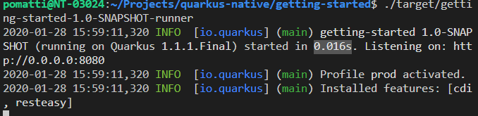
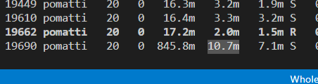

# Getting Started Project

This project uses Quarkus, the Supersonic Subatomic Java Framework.

## Benchmark

Quarkus booted in **0.016 seconds** and operated with **10 MB memory** footprint.

The example uses REST API and dependency injection provided out-of-the-box by Quarkus.

#### Total boot time



#### Total memory



## Running it

### Required software

You'll need to download some tools such as (full documentation [here](https://quarkus.io/guides/building-native-image)):

- Maven
- Quarkus CLI
- Docker
- GraalVM + native image
- JDK 11
- GCC

### Running the application in dev mode

You can run your application in dev mode that enables live coding using:
```
quarkus:dev
```

## Creating a native executable

You can create a native executable using:

```
quarkus build --native
```

You can then execute your native executable with: `./target/quarkus-native-java-api-1.0.0-SNAPSHOT-runner`

To build it directly for Docker (no GraalVM required):

```
quarkus build --native -Dquarkus.native.container-build=true
```

If you want to learn more about building native executables, please consult https://quarkus.io/guides/building-native-image-guide .

## References

[Getting Started](https://quarkus.io/guides/getting-started)

[Building Native Image](https://quarkus.io/guides/building-native-image)